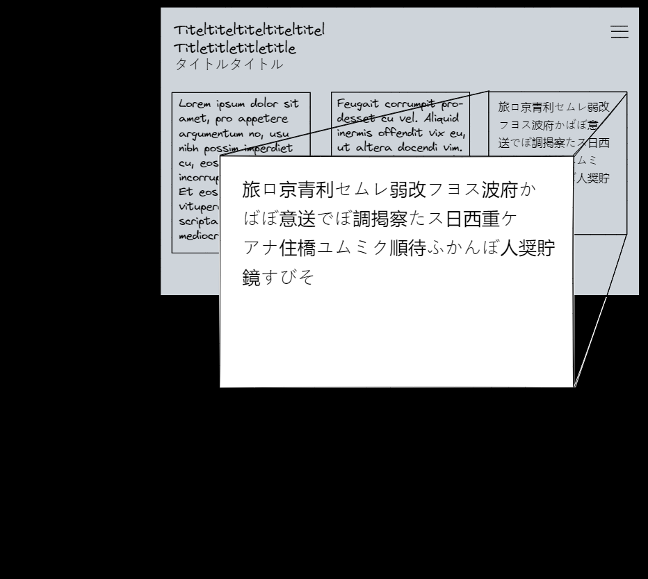

# Exophony: Dreisprachiger Blog

Mein aktuelles Projekt ist für Schriftstellerni Ann Cotten. Ein Blog, der mich vor die interessante Aufgabe stellt, eine Content Management Plattform mit einem selbst gestalteten Frontend zu verbinden.

## Die Beiträge/Posts

Die Beiträge hängen zusammen und sind jeweils auf Deutsch, Englisch und Japanisch. Die Reihenfolge und Positionierung sind wichtig, denn die erste Spalte soll immer deutsch, die zweite englisch, die dritte japanisch sein und zwar immer in einer Zeile, wenn sie zusammengehören, d.h. anderssprachige Versionen von einander sind. Die Texte sind per fuzzy search als Volltexte durchsuchbar.

## Die Gestaltung

Das Design baue ich in Absprache mit Ann. Die Ideen sind kreativ und voller Experimentierfreude. Die Mobilversion soll zum Beispiel die Texte um 90° rotiert anzeigen - ohne dass das Smartphone/das Tablet in gedrehter Position ist. Beim ersten Öffnen sollen die Texte nicht gleich angezeigt werden, sondern als 'Sterne' vor dem Hintergrundbild erscheinen und per Klick geöffnet werden.

## Tools & Technologien

- Sprachen: TypeScript, JavaScript
- Content Management Plattform: Contentful mit Contentful's Delivery API
- Volltextsuche: fuse.js
- Deployment: Fly.io, wenn der Name fixiert wurde. Als Übergang: Vercel
- CSS: Tailwind
- Framework: Next.js

### Skizze

Eine Skizze, vom Anfang der Zusammenarbeit im Dezember 2022:

